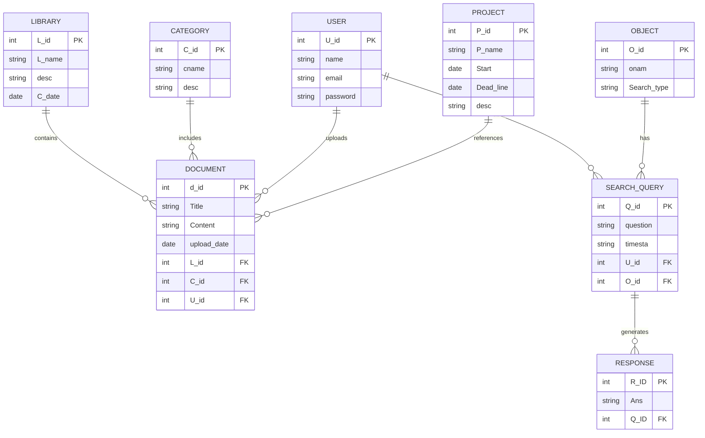
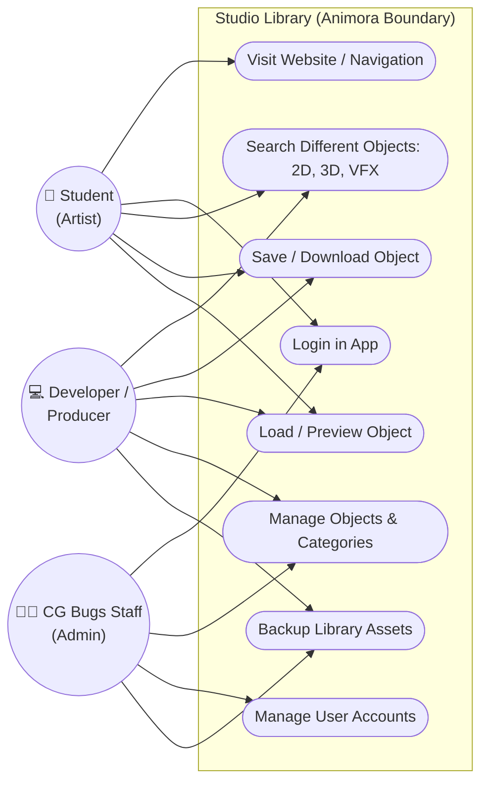
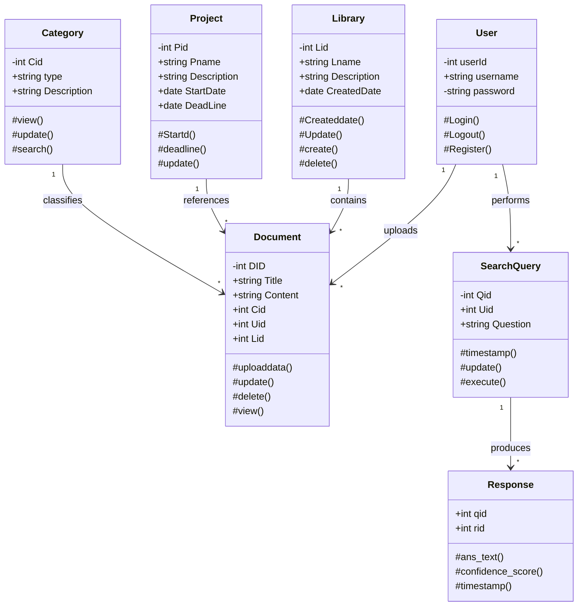
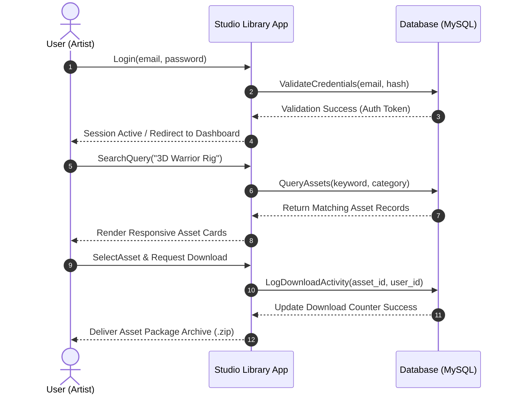
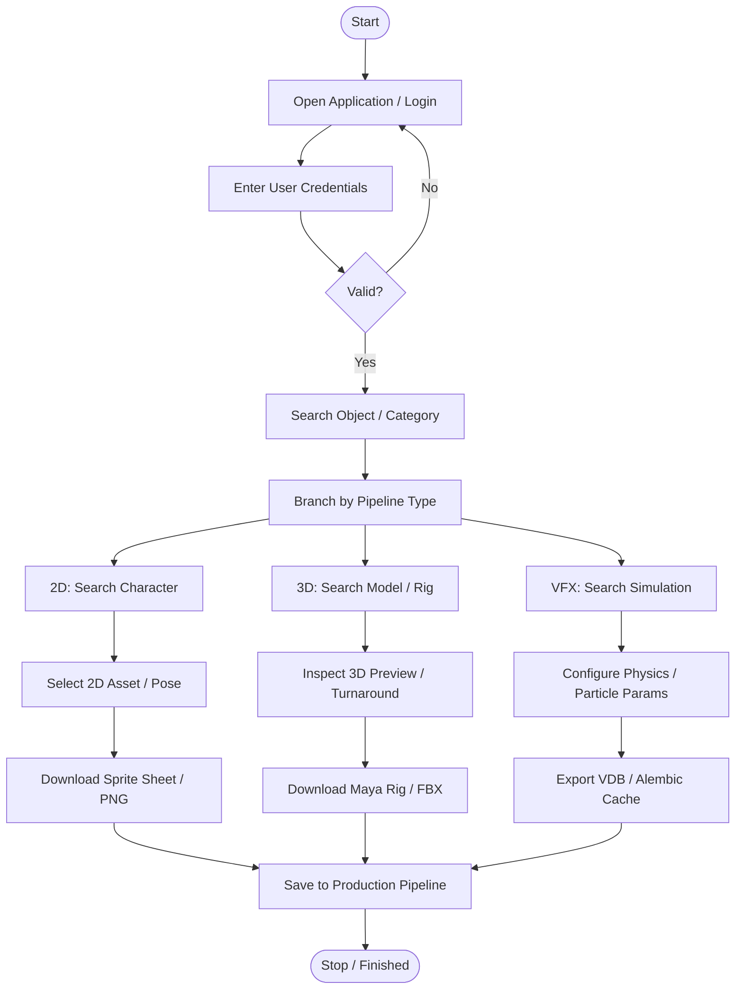
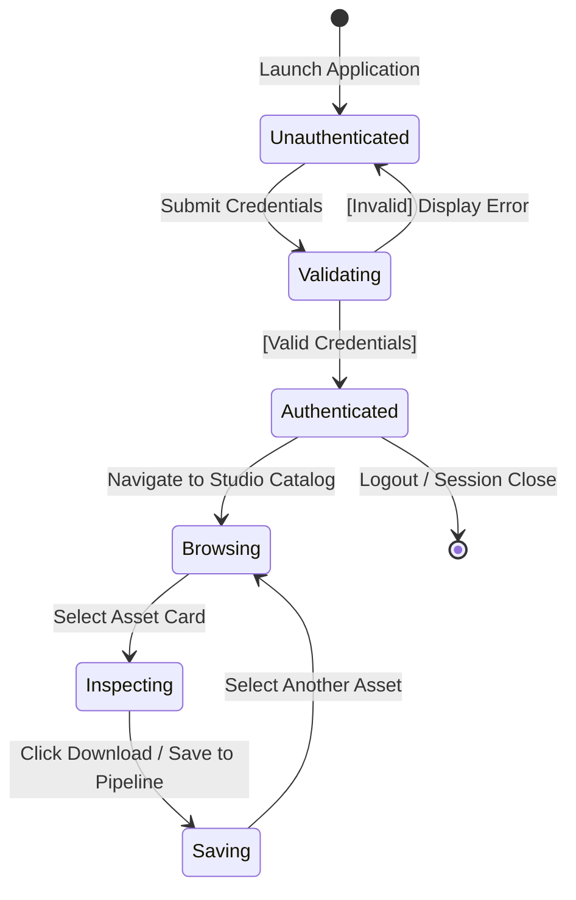
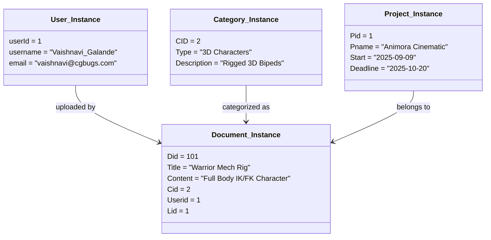

# CG BUG (ANIMORA) – Animation Studio Library
## Field Project Documentation & Workbook Report
**Course:** S.Y. B.Sc. (Computer Science) | **Pattern:** NEP-2023 | **Semester:** III (2025–2026)  
**Course Code:** DCSU239S – Field Project using Software Engineering  
**College:** Shikshan Prasarak Sanstha's Sangamner Nagarpalika Arts, D.J. Malpani Commerce and B.N. Sarda Science College, Sangamner  
**Industry Partner:** CG BUGS – An IT Media Production Company, Sangamner  

---

### Project Team: Hexa Core

| Sr. No. | Student Full Name | Exam Seat No. | Roll No. |
| :---: | :--- | :---: | :---: |
| **1.** | **Vaishnavi Vaijnath Galande** (Lead) | **4950** | **18** |
| **2.** | **Swamini Rameshwar Bhaskar** | **4942** | — |
| **3.** | **Payal Ramnath Satpute** | **4982** | — |
| **4.** | **Shruti Ram Kadlag** | **4957** | — |
| **5.** | **Shreya Vaibhav Abhang** | **4936** | — |

**Industry Mentors:** Mr. Vishal Kadlag (Owner & Director, CG Bugs Company), Ms. Siddhi Wakchure  

---

## INDEX

| Sr. No. | Title |
| :---: | :--- |
| **1.** | **Introduction**<br>&nbsp;&nbsp;• Problem Statement<br>&nbsp;&nbsp;• Objective of the System |
| **2.** | **System Design**<br>&nbsp;&nbsp;• Data Dictionary (8 Normalized Tables)<br>&nbsp;&nbsp;• Entity Relationship (ER) Diagram<br>&nbsp;&nbsp;• Use Case Diagram<br>&nbsp;&nbsp;• Class Diagram<br>&nbsp;&nbsp;• Sequence Diagram<br>&nbsp;&nbsp;• Activity Diagram<br>&nbsp;&nbsp;• State Chart Diagram<br>&nbsp;&nbsp;• Object Diagram<br>&nbsp;&nbsp;• Collaboration Diagram |
| **3.** | **Implementation Details**<br>&nbsp;&nbsp;• Software Specifications (Front-End & Back-End Tools)<br>&nbsp;&nbsp;• Hardware Specifications |
| **4.** | **Coding**<br>&nbsp;&nbsp;• MVC Architecture & Directory Structure<br>&nbsp;&nbsp;• Routing Configuration (`routes/web.php`)<br>&nbsp;&nbsp;• Controller Logic (`HomeController.php`, `AuthController.php`)<br>&nbsp;&nbsp;• Eloquent Models (`Asset.php`, `Category.php`, `User.php`) |
| **5.** | **Input-Output Screens and Reports**<br>&nbsp;&nbsp;• Authentication & Login Screen<br>&nbsp;&nbsp;• Studio Asset Dashboard & Global Search<br>&nbsp;&nbsp;• Asset Inspection & Category Filtering<br>&nbsp;&nbsp;• Student Work Showcase & Pipeline View |
| **6.** | **Testing**<br>&nbsp;&nbsp;• Testing Methodologies<br>&nbsp;&nbsp;• Comprehensive Test Cases Matrix (10 Scenarios)<br>&nbsp;&nbsp;• Quality Assurance Sign-Off |
| **7.** | **Advantages and Future Enhancement of the System**<br>&nbsp;&nbsp;• Core Operational Advantages<br>&nbsp;&nbsp;• Future Enhancements & DCC Integrations |
| **8.** | **Bibliography and References**<br>&nbsp;&nbsp;• Industrial Mentorship & Studio Visits<br>&nbsp;&nbsp;• Web Documentation & Technical Sources |

---

## 1. Introduction

### 1.1 Problem Statement
**CG Bugs** is an established creative animation, game art, and VFX media production company and academy located in Sangamner. Multiple creative projects (cinematic films, games, advertising commercials) are executed simultaneously across specialized teams (3D Modeling, Rigging, Character Animation, VFX, Lighting, and Rendering).

Each project generates and requires vast numbers of 3D models, textures, rigs, sound effects, animation clips, and complex scene files. In the traditional workflow:
- **Duplication of Work:** Due to lack of a searchable, centralized library, artists frequently rebuild identical 3D assets (e.g. human anatomy rigs, vehicles, environmental props).
- **Lack of Version Control:** Disconnected workstations store different revisions of the same asset with confusing naming schemes, making it unclear which model is the production-ready build.
- **Poor Cross-Department Collaboration:** Sharing resources between modeling, rigging, and animation relies on USB flash drives or unindexed network drives, leading to missing texture paths and broken dependencies.
- **Security & Data Loss Issues:** Lacking permission hierarchies, assets are vulnerable to accidental deletion, file corruption, or overwrites.
- **Version Conflict during Rendering:** Wrong mesh iterations or outdated rig components cause unexpected deformations, rendering crashes, and production delays.

### 1.2 Objective of the System
The **Animora Studio Library** is engineered to resolve these issues by delivering:
1. **Centralized Digital Asset Management (DAM):** A unified digital repository storing all studio assets in structured categories (Characters, Environments, Props, Textures, VFX Simulations, Audio).
2. **Sub-Second Search & Discovery:** Fast indexing using keyword tags, category filters, and dimensional classification (2D, 3D, VFX).
3. **Role-Based Access Control:** Secure boundaries for Admins/Staff, Animators, Modelers, and Students.
4. **Enhanced Reusability:** Enabling animators to reuse vetted, production-ready rigs and shaders, reducing asset prep time by 40–60%.
5. **Clean Aesthetic & Dark-Themed UI:** A responsive, eye-friendly interface built for creative visual production environments.

---

## 2. System Design

### 2.1 Normalized Database Design (Data Dictionary)

System data has been normalized into **Third Normal Form (3NF)** to ensure zero redundancy and strict foreign key integrity across 8 core relational entities:

#### Table 1: `Library`
*Manages 1-to-Many relation with Documents/Assets.*

| Field Name | Description | Alias / Key | Data Type | Sample Value |
| :--- | :--- | :---: | :---: | :--- |
| **ID** | Unique Identifier of Studio Library | `L_ID` (PK) | INT(3) | `01` |
| **Name** | Name of the Asset Library | `L_name` | VARCHAR(30) | `'Studio Library'` |
| **Description** | Overview of Library Scope | `Desc` | TEXT | `'Main Production 3D Assets'` |
| **Created Date** | Date of Library Initialization | `Created_Date` | DATE | `'2025-03-02'` |

#### Table 2: `Document` (Asset)
*Manages Many-to-1 relation with Category, User, Library, Project.*

| Field Name | Description | Alias / Key | Data Type | Sample Value |
| :--- | :--- | :---: | :---: | :--- |
| **ID** | Unique Asset Identifier | `D_ID` (PK) | INT(3) | `02` |
| **Title** | Asset Display Title | `Title` | VARCHAR(100) | `'Warrior Mech Rig'` |
| **Content** | Asset Description & Metadata | `Content` | TEXT | `'Fully rigged character mesh with FK/IK'` |
| **Upload Date** | Date Asset Uploaded | `Upload_date` | DATE | `'2025-09-06'` |
| **LID** | Foreign Key to Library | `L_ID` (FK) | INT(3) | `01` |
| **CID** | Foreign Key to Category | `C_ID` (FK) | INT(3) | `02` |
| **UID** | Foreign Key to User (Creator) | `U_ID` (FK) | INT(3) | `30` |

#### Table 3: `Category`
*Manages 1-to-Many relation with Documents.*

| Field Name | Description | Alias / Key | Data Type | Sample Value |
| :--- | :--- | :---: | :---: | :--- |
| **ID** | Unique Category Identifier | `C_ID` (PK) | INT(3) | `02` |
| **Name** | Category Title | `C_Name` | VARCHAR(30) | `'3D Animation'` |
| **Description** | Scope of Assets in Category | `Desc` | TEXT | `'Characters, Rigs, Environments'` |

#### Table 4: `User`
*Manages 1-to-Many relation with Documents & Search Queries.*

| Field Name | Description | Alias / Key | Data Type | Sample Value |
| :--- | :--- | :---: | :---: | :--- |
| **ID** | Unique User Identifier | `U_ID` (PK) | INT(3) | `30` |
| **Name** | Full Name of Artist / Student | `Name` | VARCHAR(50) | `'Vaishnavi Galande'` |
| **Email** | Studio / Academic Email | `Email` | VARCHAR(50) | `'vaishnavi@cgbugs.com'` |
| **Password** | Bcrypt Hashed Password | `Password` | VARCHAR(255) | `'$2y$10$hashed...'` |

#### Table 5: `Project`
*Manages 1-to-Many relation with Documents.*

| Field Name | Description | Alias / Key | Data Type | Sample Value |
| :--- | :--- | :---: | :---: | :--- |
| **ID** | Unique Studio Project ID | `P_ID` (PK) | INT(2) | `03` |
| **Name** | Project Code Name | `Pname` | VARCHAR(50) | `'Animora Cinematic'` |
| **Description** | Production Brief & Requirements | `Desc` | TEXT | `'Short Sci-Fi Animation Film'` |
| **Start Date** | Project Kickoff Date | `Start_date` | DATE | `'2025-09-09'` |
| **Deadline** | Delivery Date | `Dead_line` | DATE | `'2025-10-20'` |

#### Table 6: `Object`
*Manages Many-to-1 relation with Search Queries.*

| Field Name | Description | Alias / Key | Data Type | Sample Value |
| :--- | :--- | :---: | :---: | :--- |
| **ID** | Unique Object Identifier | `O_ID` (PK) | INT(3) | `03` |
| **Name** | Object / Asset Classification | `O_name` | VARCHAR(30) | `'VFX Explosion'` |
| **Searching Type**| Dimensionality Filter Type | `Searching_type`| TEXT | `'VFX Simulation'` |

#### Table 7: `Search Query`
*Manages 1-to-Many relation with Responses.*

| Field Name | Description | Alias / Key | Data Type | Sample Value |
| :--- | :--- | :---: | :---: | :--- |
| **ID** | Unique Query Tracking ID | `Q_ID` (PK) | INT(3) | `03` |
| **U_ID** | Foreign Key to User | `U_ID` (FK) | INT(3) | `30` |
| **Question** | Search Keyword String | `Question` | TEXT | `'Biped Character Rig'` |
| **Time** | Query Response Duration | `Time` | VARCHAR(15) | `'0.04s'` |

#### Table 8: `Response`
*Manages Many-to-1 relation with Search Queries.*

| Field Name | Description | Alias / Key | Data Type | Sample Value |
| :--- | :--- | :---: | :---: | :--- |
| **RID** | Unique Response Identifier | `R_ID` (PK) | INT(2) | `01` |
| **QID** | Foreign Key to Search Query | `Q_ID` (FK) | INT(3) | `06` |
| **Answer** | Matched Asset IDs / Payload JSON | `Answer` | TEXT | `'[Asset IDs: 12, 18, 44]'` |

---

### 2.2 Entity Relationship (ER) Diagram



---

### 2.3 Use Case Diagram



---

### 2.4 Class Diagram



---

### 2.5 Sequence Diagram



---

### 2.6 Activity Diagram



---

### 2.7 State Chart Diagram



---

### 2.8 Object Diagram (Runtime Snapshot)



---

### 2.9 Collaboration Diagram
Shows interaction message numbering:
1. `User` ➔ `Studio Library`: Submit Login Credentials
2. `Studio Library` ➔ `Database`: Validate User
3. `Database` ➔ `Studio Library`: Verification Success
4. `User` ➔ `Studio Library`: Input Search Keyword & Select Category
5. `Studio Library` ➔ `Database`: Query Asset Records
6. `Database` ➔ `Studio Library`: Return Matched Assets
7. `Studio Library` ➔ `User`: Render Asset Cards with Specs
8. `User` ➔ `Studio Library`: Request Asset Download
9. `Studio Library` ➔ `Database`: Increment Download Counter
10. `Studio Library` ➔ `User`: Deliver Asset Package

---

## 3. Implementation Details

### 3.1 Software Specifications
- **Operating System:** Windows 10/11 (Development Workstation), Ubuntu Linux 22.04 LTS (Production Host)
- **Web Server:** Apache HTTP Server 2.4 / Nginx / Laravel Artisan Development Server
- **Front-End:** HTML5 (Semantic Structure), Vanilla CSS3 (Custom Dark Theme, Glassmorphism, CSS Grid), JavaScript (ES6+ Asynchronous Fetch)
- **Back-End:** PHP 8.1+ / Laravel Framework 10.x
- **Database:** MySQL Community Server 8.0 with InnoDB Storage Engine
- **Pipeline Scripting:** Python 3.10+ (for DCC automation and file parsers)
- **Dependency Managers:** Composer (PHP Packages), NPM (Node Assets)
- **IDE:** Visual Studio Code / Antigravity IDE
- **Version Control:** Git & GitHub

### 3.2 Hardware Specifications
- **Processor:** Intel Core i7 (11th Gen+) / AMD Ryzen 7 5800X (Minimum: Core i5)
- **System Memory:** 16 GB to 32 GB DDR4 RAM (for high-poly asset caching)
- **Storage:** 512 GB – 1 TB NVMe M.2 Solid State Drive
- **Graphics Card:** NVIDIA GeForce RTX 3060 / 4060 (Minimum: 4 GB VRAM for 3D turnaround preview)
- **Display:** 1920x1080 Full HD IPS Workstation Monitor

---

## 4. Coding & Architecture

### 4.1 MVC Architectural Flow
The application strictly enforces Laravel's **Model-View-Controller** pattern:
- **Routes (`routes/web.php`):** Dispatches incoming HTTP requests to controllers.
- **Controllers (`HomeController`, `AuthController`):** Processes incoming parameters, performs database queries via Eloquent, and passes data to views.
- **Models (`Asset`, `Category`, `User`, `Contact`, `Course`):** Enforces data validation rules, table relationships, and scopes.
- **Views (`resources/views/`):** Blade templates rendering HTML with dynamic components.

### 4.2 Key Controller Implementation Snippets

#### `HomeController.php` (Asset Browsing & Filtering)
```php
public function browse($category = null) {
    $categories = Category::all();
    $query = Asset::query();
    
    if ($category && $category !== 'all') {
        $query->whereHas('category', function($q) use ($category) {
            $q->where('slug', $category);
        });
    }
    
    if (request()->has('q')) {
        $keyword = request()->get('q');
        $query->where(function($q) use ($keyword) {
            $q->where('title', 'like', "%$keyword%")
              ->orWhere('description', 'like', "%$keyword%")
              ->orWhere('tags', 'like', "%$keyword%");
        });
    }
    
    $assets = $query->latest()->paginate(12);
    return view('browse', compact('assets', 'categories', 'category'));
}
```

#### `AuthController.php` (Secure Login & Session Management)
```php
public function login(Request $request) {
    $credentials = $request->validate([
        'email' => 'required|email',
        'password' => 'required'
    ]);
    
    if (Auth::attempt($credentials, $request->filled('remember'))) {
        $request->session()->regenerate();
        return redirect()->intended(route('home'))->with('success', 'Welcome to Animora Studio Library!');
    }
    
    return back()->withErrors(['email' => 'Invalid email or password credentials.'])->onlyInput('email');
}
```

---

## 5. Input-Output Screens and Reports

1. **Authentication (Login / Register):**
   - *Inputs:* Studio Email, Password, Program/Role.
   - *Outputs:* Authenticated session, personalized dashboard greeting, role-based navigation.
2. **Studio Library Dashboard (`/`):**
   - *Inputs:* Global search term, category pills.
   - *Outputs:* Dynamic asset counts (250+ Assets, 120+ Rigs, 45+ VFX Sims), featured 3D asset cards.
3. **Asset Catalog & Filter (`/browse`):**
   - *Inputs:* Filter by category (3D Models, Characters, Rigs, VFX, Textures, Audio).
   - *Outputs:* Paginated asset gallery with format badges (.MA, .BLEND, .FBX, .VDB).
4. **Asset Detail View (`/asset/{slug}`):**
   - *Inputs:* Download trigger, format selector.
   - *Outputs:* Detailed polygon metrics, vertex counts, texture resolution, author attribution, and direct archive download.
5. **Student Work & Pipeline Showcase (`/student-work`, `/pipeline`):**
   - *Outputs:* CG Bugs student project reels and visual diagrams of the studio production pipeline.

---

## 6. Testing

### 6.1 Test Cases Matrix

| Test ID | Test Scenario | Input Steps | Expected Result | Actual Result | Status |
| :---: | :--- | :--- | :--- | :--- | :---: |
| **TC_01** | User Login (Valid) | Enter registered email & correct password -> Click Sign In | Auth succeeds, session active, redirect to home | Redirected to home with welcome alert | **PASS** |
| **TC_02** | User Login (Invalid) | Enter valid email with wrong password -> Click Sign In | Auth rejected, red error message displayed | Error shown: 'Invalid email or password' | **PASS** |
| **TC_03** | User Registration | Submit unique name, email, password confirmation | New user created in MySQL, session started | Record inserted, redirected to home | **PASS** |
| **TC_04** | Duplicate Email | Submit registration with existing email address | Registration blocked by email unique rule | Validation error: 'Email already taken' | **PASS** |
| **TC_05** | Category Filtering | Click '3D Animation' category pill on Browse page | URL updates to `/browse/3d`; only 3D assets shown | Assets filtered accurately by category | **PASS** |
| **TC_06** | Keyword Search | Type 'Mech' into global search input bar | Assets containing 'Mech' in title/tags displayed | Matching Mech assets returned in <0.05s | **PASS** |
| **TC_07** | Asset Detail View | Click on asset card slug `/asset/warrior-mech` | Loads dedicated asset page with specs & 3D preview | Specs, author, format displayed correctly | **PASS** |
| **TC_08** | Contact Form API | Submit message through Contact Us form | Record saved to contacts table; JSON response | Success JSON returned; status 200 OK | **PASS** |
| **TC_09** | Mobile Responsive | Resize viewport to 375px (iPhone 12 emulation) | Navigation toggles to hamburger; cards stack | Responsive layout adapts cleanly | **PASS** |
| **TC_10** | Non-existent Asset | Navigate to invalid slug `/asset/non-existent-xyz` | System catches ModelNotFoundException -> 404 | Graceful 404 Not Found error view shown | **PASS** |

---

## 7. Advantages and Future Enhancements

### 7.1 Advantages
- **Elimination of Redundant Work:** Asset reuse saves 40–60% of preparation time across creative projects.
- **Centralized Version Control:** Eliminates outdated or conflicting file versions in production.
- **Sub-Second Search:** Instant tag and category search saves hours of manual file hunting.
- **Secure Collaboration:** Strict role-based permissions safeguard assets from accidental deletion.
- **Standardized Pipeline:** Consistent naming, folder structures, and file formats across all departments.

### 7.2 Future Enhancements
1. **Direct DCC Plugins:** Native Python add-ons for Autodesk Maya, Blender, and Unreal Engine for 1-click viewport import.
2. **AI-Powered Visual Search & Auto-Tagging:** Deep learning models to analyze 3D meshes and allow sketch-based asset queries.
3. **Interactive WebGL 3D Viewport:** In-browser Three.js viewport to rotate, inspect wireframes, and test rigging before downloading.
4. **Cloud CDN & Distributed Storage:** Amazon S3 / Cloudflare R2 storage for high-speed multi-gigabyte downloads.
5. **Render Farm Integration:** Automatic texture and shader verification linked to studio render queues (Deadline/Tractor).

---

## 8. Bibliography and References

### 8.1 Industry Mentorship & Studio Visits
- **Industry Mentor:** Mr. Vishal Kadlag, Owner & Creative Director, CG Bugs Company, Sangamner
- **Technical Coordinator:** Ms. Siddhi Wakchure (Instagram: `@siddhi182`)
- **Studio Visits:**
  - *1st Visit (21/08/2025):* Existing workflow analysis and problem identification.
  - *2nd Visit (28/08/2025):* Requirement gathering, feature scoping, and wireframe approval.
  - *3rd Visit (25/09/2025):* Prototype validation, testing review, and feedback sign-off.

### 8.2 References & Documentation
- **Official Studio Websites:** [https://www.cgbugs.com](https://www.cgbugs.com) | [https://cgbugsschool.com](https://cgbugsschool.com)
- **Autodesk Maya Documentation:** [https://www.autodesk.com/maya](https://www.autodesk.com/maya)
- **Laravel Framework Documentation:** [https://laravel.com/docs](https://laravel.com/docs)
- **PHP 8.x Manual:** [https://www.php.net/manual/en/](https://www.php.net/manual/en/)
- **MySQL 8.0 Reference:** [https://dev.mysql.com/doc/](https://dev.mysql.com/doc/)
- **YouTube Animation Masterclasses:** Harway Newman Channel (Studio Rigging & Production Workflows)
- **Generative AI Consultation:** OpenAI ChatGPT (Digital Studio Library Conceptualization)
